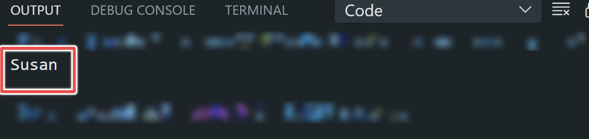

# Values and Variables in JavaScript


#### Tables of Contents

#### Introduction

#### What are values in JavaScript

#### What are variables in JavaScript

#### How to declare a varable in JavaScript

#### How to store data value to a variable

#### Best practices for naming variables in JavaScript

#### Conclusion

### Introduction

JavaScript is a high level programming langugage that can be used in web development, mobile development, building games and other other areas of software development.  
Values and vareables are one of the fundamental concepts in JavaScript that when used properly, can help you to write clean and efficent JavaScript codes.

In this article, you will learn about values and variables in JavaScript with detailed examsples and best practices best practices for naming variables in JavaScript.

### What are values in JavaScript

Values are the smallest unit of imformation in JavaScript. Every piece of data in JavaScript are considered to contain a value. For example,  
"Susan" is a value. If you want to see this value in the console, type :

```
console.log("Susan")
```

The output is shown below:



From the result above, the output in the terminal is the same with value entered in the console. Values have different data types such as strings, numbers, booleans,arrays, obejects and so on. You can give name to values by assigning them to a variable. Values are reusable when assigned to a variable in order words, when stored in a variable.

### What are variables in JavaScript

Variables are used to store data values and can be accessed throughout the programe.
Variables act like containers that are used to hold values and can be updated and retrieved when needed. For example, in the example used above, the value "Susan" can not be retrieved for use later in the program because it was not stored in a variable. If you want to keep using "Susan" the it has to be stored in a variable. You can think of a variable as a container with name that stores the value Susan, each time you need to used retrieve the value Susan, you simply go to the container,in JavaSript, this is referred to as
**calling a variable**

<!--
In JavaScript, variables are declared using three reserved keywords which are: "var", "const", and "let".  -->

### How to declare a variable in JavaScript

You can decleare a variable in JavaScript using any of the three reserved keywords in JavaScript which are:

1. let
2. var
3. const

For example:

```
let myName
var myName
const myName
```

Using any of this researved keyword shows that you want to store your values in a variable.

### How to store data value to a variable

You can store data value to a variable using the assignment operator. In JavaScript, the assignment operetor is the "**=**" symbol.This symbol is called **the assignment operator** To store a value, place your variable on the left side of the symbol and place your value at the right side. Storing a value in a variable is also known as at the same time
**initializing a variable** The example be shows how to initialize a variabel:

```
let myName   = "Susan"
var myName   = "Susan"
const myName = "Susan"
```

### Best practices for naming variables in JavaScript

Below are list of best practices for naming varibles in JavaScript:

1. 

